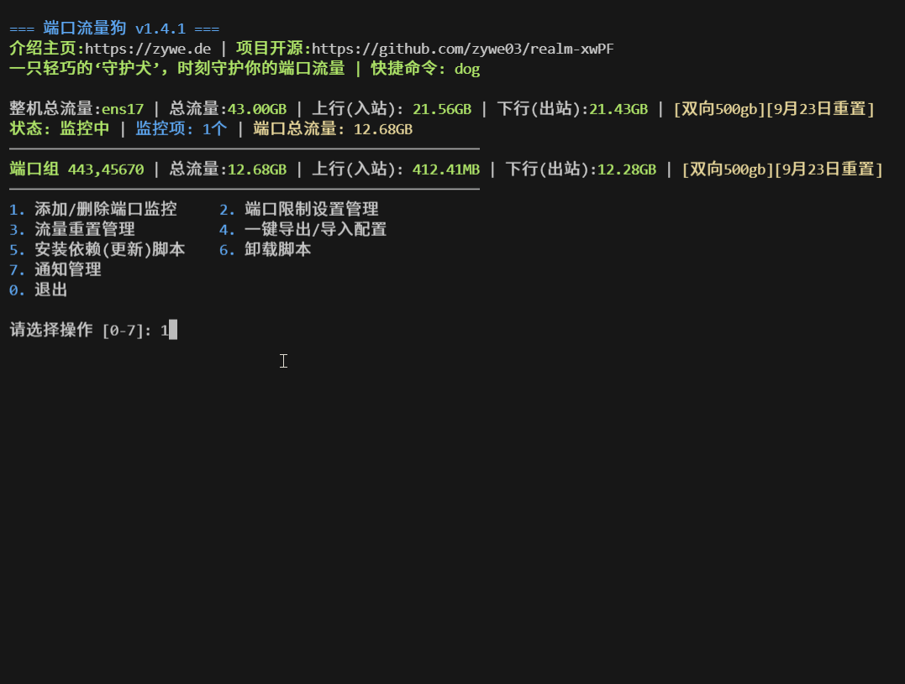

# 端口流量狗 (Port Traffic Dog)

> 一只轻巧的“守护犬”，随时守护你的端口和整机流量，让流量监控和管理更简单。

🔔 **端口流量狗**是一款轻量级 Linux 端口流量监控与管理工具，基于 `nftables` 和 `tc`，支持精准的**端口级**与**整机**流量统计、速率限制与流量配额控制。

## 脚本界面预览

**主界面**


## 适用场景

### 🌐 网络服务监控

- 中转、Web 服务器、代理服务、游戏服务器等
- 为没有流量管理的程序附加轻量级的监控与控制能力

### 💰 流量计费管理

- **VPS 流量控制**：避免超额流量导致额外费用
- **成本管理**：通过速率与流量限制来降低运营成本

## ✨ 核心功能

### 流量监控

- **持久化**：即使服务器异常关机或重启，完全无感保持数据正常工作
- **精确统计**：基于 `nftables` 的端口级流量监控
- **整机流量**：默认开启，无需手动添加（主界面显示为“整机流量”）；基于网卡计数器每分钟增量计算，不新增防火墙规则，重启/网卡重建自动校准
- **从安装起算**：整机流量自安装脚本起开始累计，安装前的历史流量不计入
- **双向支持**：支持单向（出站）和双向（入站+出站）流量统计
- **监控项语法**：添加端口时用三种分隔符组合——`-` 表端口段（`100-200`），`,` 表同组共享（`443,80` 两端口共享同一套统计/配额/限速/重置），`;` 表独立监控项（`443;80` 两个各自独立）。可混合：`443,5000-5100;22222` 表示一个端口组加一个独立端口。同一端口不能跨监控项重复，端口区间重叠会被直接拒绝。
- **实时统计**：实时累计流量数据

### 流量控制

- **速率限制**：基于 `tc` 的端口速率控制（支持 Kbps/Mbps/Gbps）
- **整机限速**：限制整机出入口总速率，与端口限速同时生效时自动取最小值组合
- **突发速率处理**: 动态计算 burst 值,既能应对瞬间速率高峰，又不会过度放宽限制
- **流量配额**：基于 `nftables quota` 的月度流量配额（支持 MB/GB/TB）
- **自动重置**：端口可配置每月流量自动重置（默认每月 1 日，支持 1–31 日自定义）
- **超限阻断**：流量超限后自动阻断，支持手动重置恢复
- **截止日期**：支持为端口/端口组设置最终到期日（`YYYY-MM-DD`），到期后内核自动阻断连接，延期或设为 0 取消后自动恢复
- **整机配额告警**：整机流量配额与端口同路径设置，超限以标签与推送预警提示，不阻断整机流量（防止误判断 SSH）

### 数据与记录

- **一键导出/导入**：完整迁移配置与数据
- **历史记录**：保留流量重置历史
- **日志轮转**：自动日志清理和轮转

### 通知系统

- **独立模块分隔**: 同时启用两个,各自独立的间隔设置,任意禁用其中一个,不影响另一个
- **Telegram 通知**：支持机器人推送，可自定义 API Host 中转 api.telegram.org
- **Webhook 通知(企业微信/飞书/钉钉)**：支持群机器人推送
- **状态汇报**：可按间隔（1 分钟–24 小时）推送状态

### 端口备注管理

- **多用户场景**：为不同端口(用户)添加备注，方便管理

## 🚀 一键安装

> 端口流量狗脚本属于完整独立脚本，可单独安装使用(快捷键:dog)

### 方式一：直接安装

```bash
wget -O port-traffic-dog.sh https://raw.githubusercontent.com/zywe03/realm-xwPF/main/port-traffic-dog.sh && chmod +x port-traffic-dog.sh && ./port-traffic-dog.sh
```

### 方式二：使用加速源

```bash
wget -O port-traffic-dog.sh https://v6.gh-proxy.org/https://raw.githubusercontent.com/zywe03/realm-xwPF/main/port-traffic-dog.sh && chmod +x port-traffic-dog.sh && ./port-traffic-dog.sh
```

若加速源失效，可多次重试或更换其他具有内置加速功能的代理源

## 系统要求

### 自动安装的依赖

遵循**Linux原生轻量化工具**原则，保持系统干净整洁：

- `nftables` - 现代网络过滤框架，替代iptables
- `iproute2` - 网络工具套件(包含tc、ss、ip命令)
- `jq` - JSON处理工具
- `gawk` - GNU AWK文本处理工具
- `bc` - 基础计算器，用于流量单位转换
- `unzip` - 解压缩工具

### 配置文件位置

- **主配置**: `/etc/port-traffic-dog/config.json` - 端口配置、通知设置等
- **整机流量数据**: `/etc/port-traffic-dog/vps_traffic.json` - 整机流量采集数据
- **日志目录**: `/etc/port-traffic-dog/logs/` - 运行日志和通知日志
- **通知模块**: `/etc/port-traffic-dog/notifications/` - Telegram、Webhook(企业微信/飞书/钉钉)等通知脚本

## Telegram通知配置

### 1. 创建Telegram机器人

1. 在Telegram中找到 @BotFather
2. 发送 `/newbot` 创建新机器人
3. 获取Bot Token

### 2. 获取Chat ID

1. 将机器人添加到群组或私聊
2. 发送任意消息给机器人
3. 访问 `https://api.telegram.org/bot<TOKEN>/getUpdates`
4. 从返回结果中找到chat_id

### 3. 配置通知

在脚本主菜单选择：
8. 通知管理 → 1. Telegram机器人通知

配置项：

- Bot Token
- Chat ID
- 服务器名称
- Telegram API Host（可选，中转机连不上 api.telegram.org 时填反代/镜像地址，直连回车跳过）
- 状态通知(可选间隔：1分钟到24小时)
- 邀请自己的机器人到群组,然后在输入ID那里输入群组ID就可以在群组通知，，输入个人ID就个人通知

## webhook(企业微信/飞书/钉钉群机器人)通知配置

1. 在对应平台(企业微信/飞书/钉钉)的群中添加群机器人
2. 获取机器人的 Webhook URL
3. 脚本「1. 配置Webhook信息」中先选平台(企业微信/飞书/钉钉)，再粘贴 Webhook URL 与服务器名称

---

## 💖 如果对你有帮助


